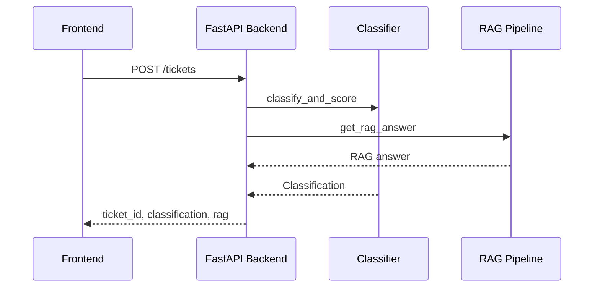
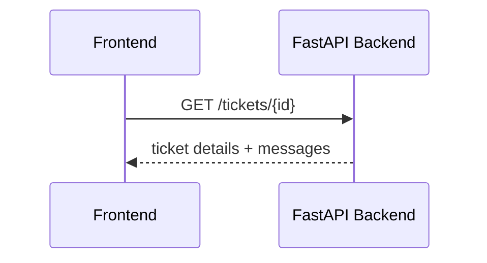
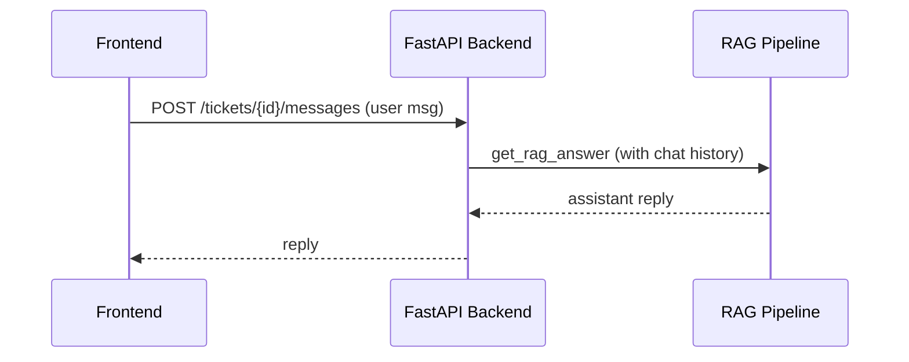
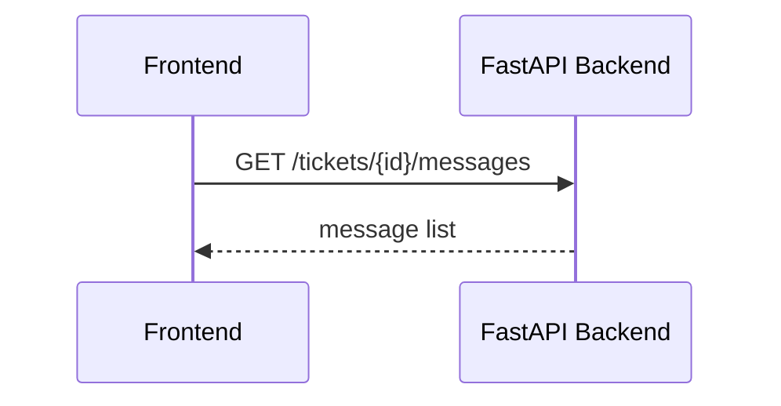
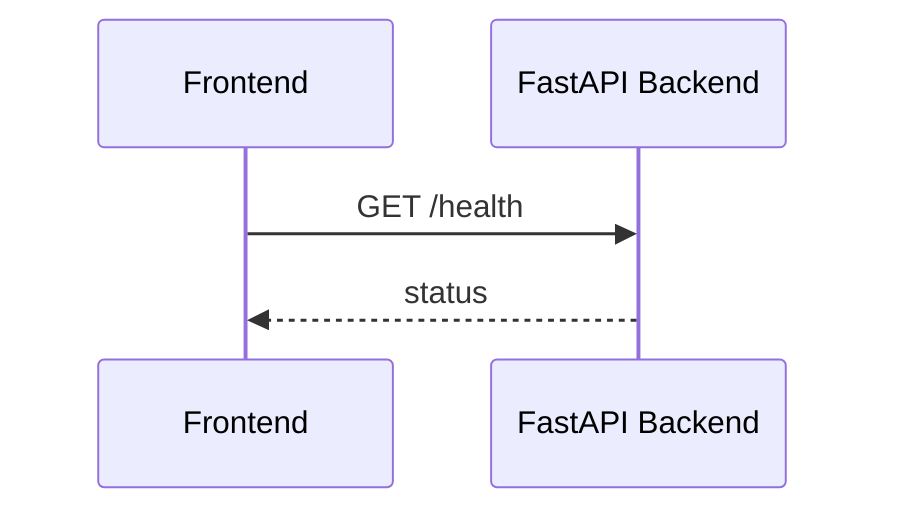

# Smart Customer Support RAG System – Flow Overview

This document describes what happens in the background for each main user action, showing which API endpoints and backend functions are called, and how data flows through the system.

---

## 1. Submit Ticket
**User Action:** Fill and submit the support ticket form in the frontend.

**API Call:**
```
POST /tickets
```

**Backend Flow:**
- `main.py:create_ticket`
    -> `ticket_classifier.classify_and_score`
    -> `rag_pipeline.get_rag_answer`

**Arrow Flow:**
Frontend Form -> `/tickets` -> `create_ticket` -> `classify_and_score` -> `get_rag_answer` -> Store ticket -> Respond

**Mermaid Diagram:**


---

## 2. View Ticket Details
**User Action:** Click a ticket in the frontend table.

**API Call:**
```
GET /tickets/{ticket_id}
```

**Backend Flow:**
- `main.py:get_ticket`
    -> Fetch ticket from DataFrame
    -> Attach `messages` (chat history)

**Arrow Flow:**
Frontend -> `/tickets/{id}` -> `get_ticket` -> Return ticket + messages

**Mermaid Diagram:**


---

## 3. Chat on Ticket
**User Action:** Open chat and send a message.

**API Call:**
```
POST /tickets/{ticket_id}/messages
```

**Backend Flow:**
- `main.py:post_message`
    -> Append user message to in-memory history
    -> `rag_pipeline.get_rag_answer` (with full chat history)
    -> Append assistant reply to history

**Arrow Flow:**
Frontend Chat -> `/tickets/{id}/messages` -> `post_message` -> `get_rag_answer(history)` -> Store reply -> Respond

**Mermaid Diagram:**


---

## 4. Fetch Chat History
**User Action:** Open chat panel for a ticket.

**API Call:**
```
GET /tickets/{ticket_id}/messages
```

**Backend Flow:**
- `main.py:get_messages`
    -> Return all messages for ticket

**Arrow Flow:**
Frontend -> `/tickets/{id}/messages` -> `get_messages` -> Return messages

**Mermaid Diagram:**


---

## 5. Health Check
**User Action:** App loads, checks backend status.

**API Call:**
```
GET /health
```

**Backend Flow:**
- `main.py:health`

**Arrow Flow:**
Frontend -> `/health` -> `health` -> Return status

**Mermaid Diagram:**

